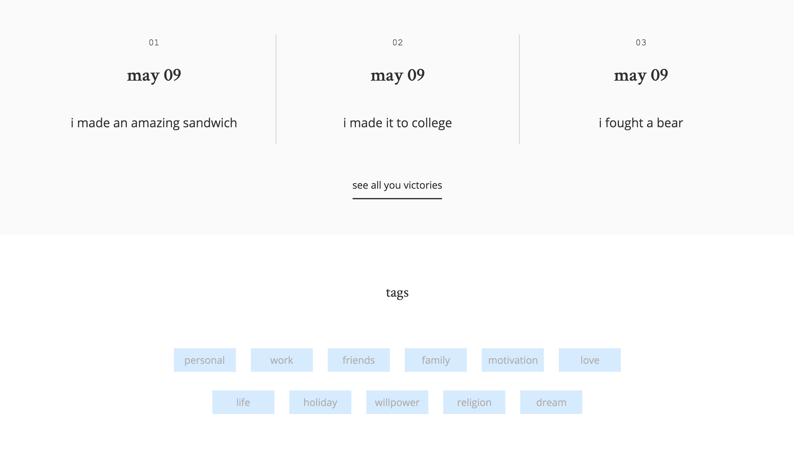
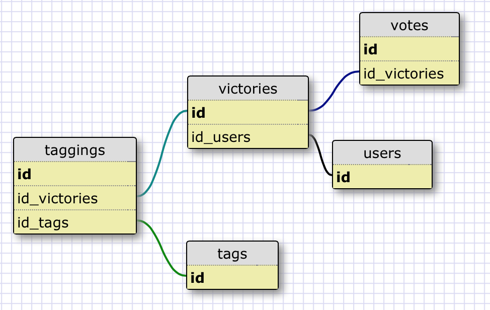

# little victories

[See a demo](http://littlevictories.herokuapp.com/)

There are little moments in life where we celebrate our little victories.  Whether big or small, they are easily forgotten in the busy world we live in.  It would be nice to sit down at the end of the year and reflect on all of the little victories we accomplished but it is so hard to remember everything that has happened.  With little victories, you will be able to write down those precious moments and look at them all at a later time.

You can also browse through random victories of anonymous users and share in their successes.  little victories will allow you to give victories an upvote to let the user know that you have acknowledge them.  Votes counts are not public and only for the purposes of sharing in someone else's success.

## Features

* CRUD
* User authentication
* Secure password with Bcrypt
* Ajax of victory creations
* JavaScript hide/show of additional tagging options
* Allows upvoting of victories
* Sorting by tags

## Design

Home page.  You can create your victories right at the top and the new post will replace the random victory below through Ajax.

Below, users will see 3 random victories they have posted throughout the year.

At the bottom, users can see browse other people's victories.  Four random victories are displayed.  Users remain anonymous, only their first initial and city are shown.

## Schema

Final schema design.

